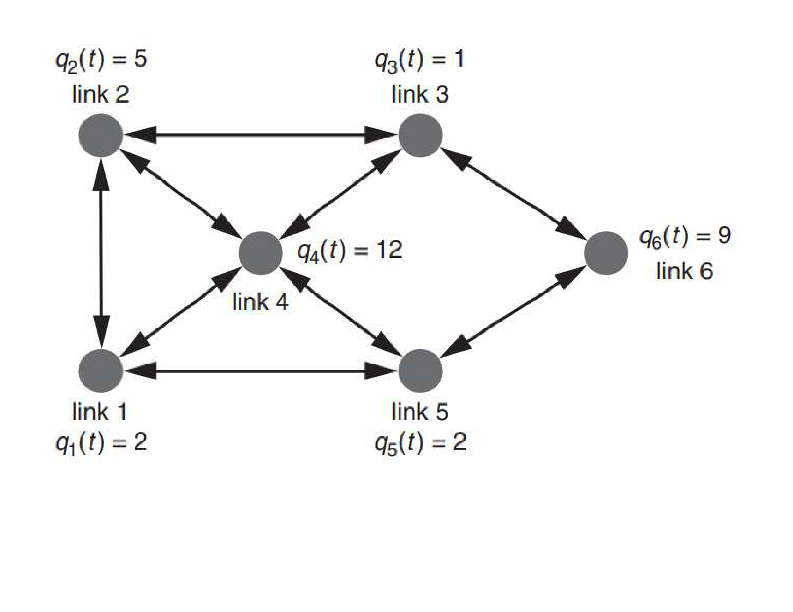
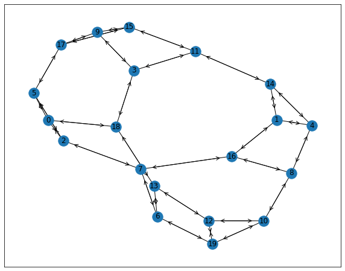

# A Scalable MARL Solution for Scheduling in Conflict Graphs

This repository contains the code implementation for the paper "Distributed MARL for Scheduling in Conflict Graphs" presented at the 2023 59th Annual Allerton Conference on Communication, Control, and Computing.

## Conflict Graph

In wireless networks, links may conflict with one another if activated simultaneously on the same sub-band due to wireless interference or physical constraints. We model this using a directed conflict graph denoted as $\mathcal{G}=(\mathcal{I}, \mathcal{E})$, where:

- Each vertex in $\mathcal{I}$ represents a link
- An edge $(i,j)\in\mathcal{E}$ with $i,j\in\mathcal{I}$ and $i\ne j$ indicates that link $i$ would cause conflict to link $j$ if they are activated on the same sub-band

Examples of conflict graphs:


*Figure 1: A conflict graph with 6 nodes*


*Figure 2: A conflict graph with 20 nodes*

Here we studies the case where each agent controls one link as in an ad hoc network, one of our other paper in Asilomar 2024 develops an MARL framework for cellular wireless networks, where each agent manages all links in a cell. In our recent work for Allerton 2024, we moved to SINR-based model in celluar wireless networks.

## Training:
This repository contains two separate directories for 6-link and 20-link conflict graphs, as shown in the example figures. We'll use the 20-link directory (`MARL_20links`) as an example in the following sections.

The core implementation of the conflict graph and links with dynamic traffic can be found in `MARL_20links/envs/env_core.py`. Researchers can modify this file to accommodate their own environments.

To start training:

1. Navigate to the `MARL_20links/train` directory.
2. Run `train.py`:
You can tune learning hyperparameters in `config.py` and change settings like arrival rate and conflict graph size in `train.py`.

After training, the model and learning history will be stored in the `MARL_20links/results` directory. The model is saved, and you can use TensorBoard to examine the learning curve.

Note: We have already updated the training results, but you may train the models from scratch as well.

## Evaluation

To evaluate a trained model:

1. Specify the model you want to test in `MARL_20links/train/eval.py`.
2. Run `eval.py`:

This will generate saved evaluation data. Move this data to the `simulation_results` directory.

In the `simulation_results` directory, you'll find two benchmarks: greedy and Q-CSMA. You can generate baseline data for comparison.

To generate result figures:

1. Navigate to the `simulation_results` directory.
2. Run `generate_fig_new.py`:
Copy
This will produce results similar to those shown in `ch1_20nodes_dr0.15delay.png` and `ch1_6nodes_dr0.15delay.png`.

## Citation

If you use this code in your research, please cite our paper:

```bibtex
@inproceedings{zhang2023distributed,
title={Distributed MARL for Scheduling in Conflict Graphs},
author={Zhang, Yiming and Guo, Dongning},
booktitle={2023 59th Annual Allerton Conference on Communication, Control, and Computing (Allerton)},
pages={1--8},
year={2023},
organization={IEEE}
}
